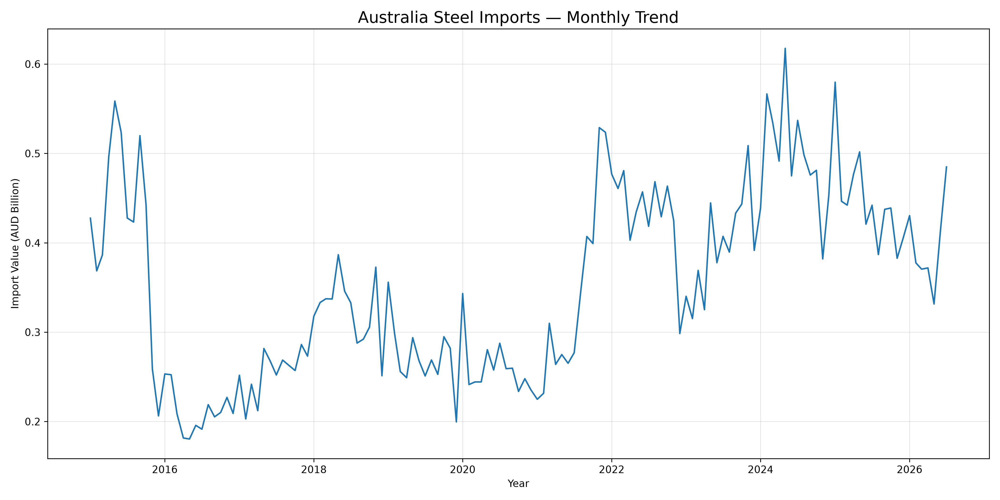
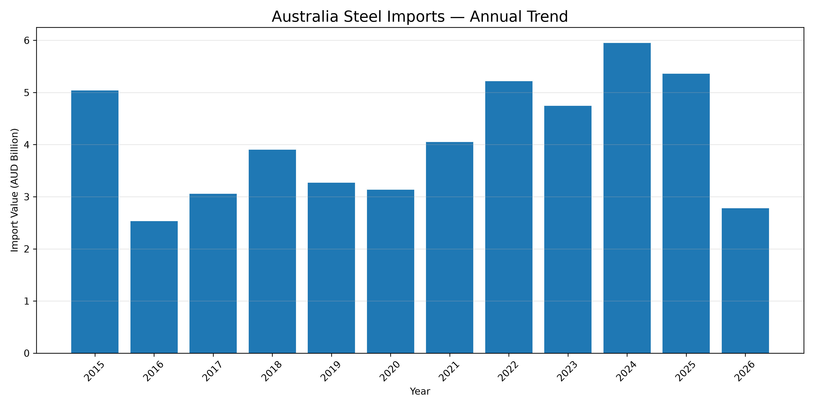
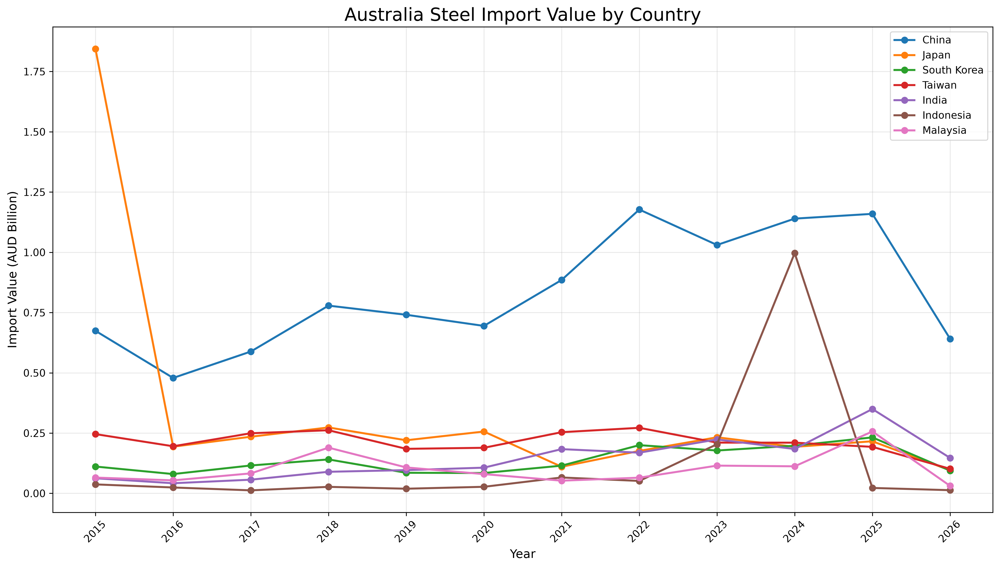
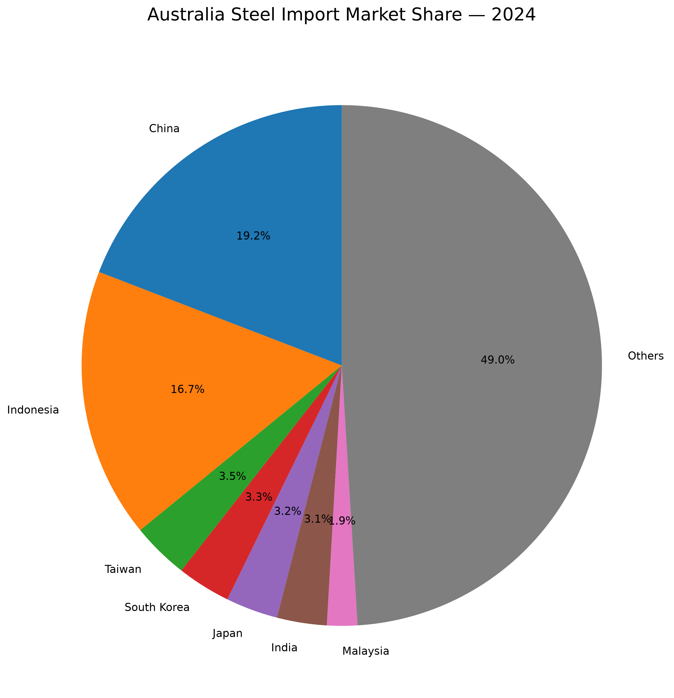
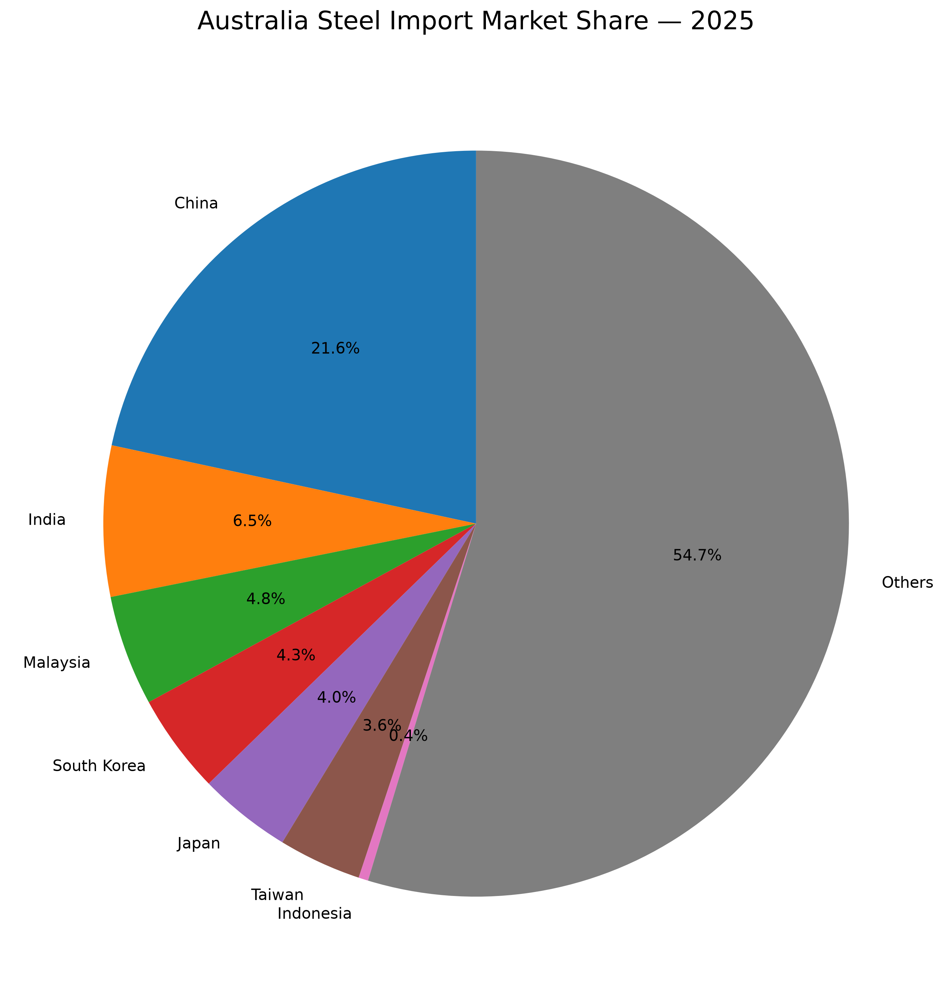
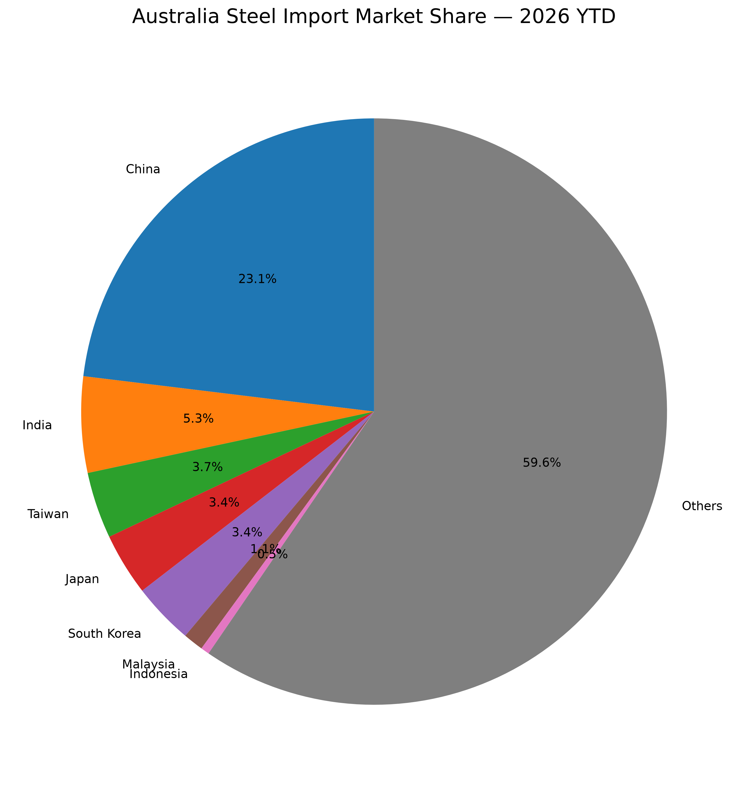
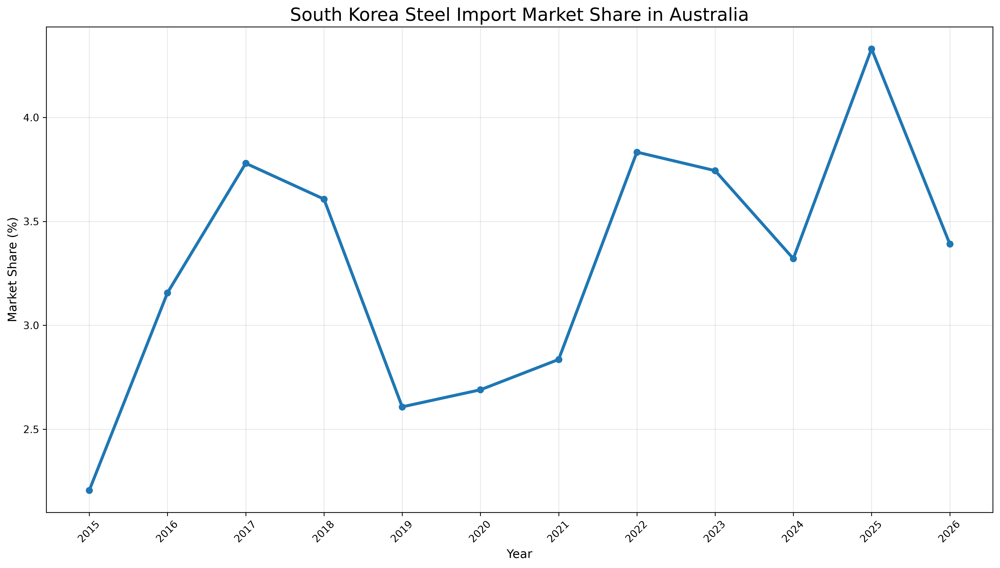
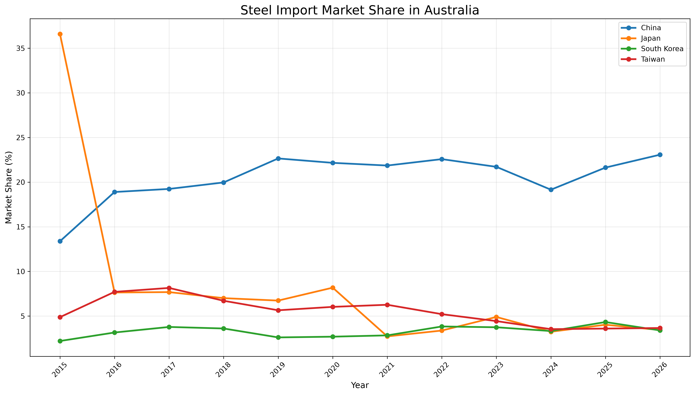

# Australia Steel Import Market Analysis

**Australian Steel Import Market | 2015–2026**

Analysis of Australia's steel import market using Australian Bureau of Statistics (ABS) merchandise import data.

> A Python-based analysis of import trends, source countries and market share movements, with a focus on South Korea.

## Project Overview

This project analyses Australia's steel imports from January 2015 to July 2026.

The analysis focuses on:

- Overall monthly and annual import trends
- Import values by country of origin
- Recent changes in major source countries
- Market share by source country
- Long-term changes in supplier market share
- South Korea's import value and market share

The project uses ABS data to examine how Australia's steel import market has changed over time.

## Key Analysis

### 01 — Overall Import Trends

Monthly and annual import values were analysed to identify changes in Australia's steel import market over the long term.





Import values have varied considerably over the period, with higher levels generally observed during the early 2020s compared with much of the earlier period.

### 02 — Source Country Analysis

Imports were grouped by country of origin to identify major suppliers and changes in Australia's supplier composition.



Country-level analysis covers both long-term import values and recent changes in import activity.

Records where the country of origin was not specified by ABS are reported as **"No Country Details"** and are not treated as a specific country.

### 03 — Market Share

Market share was calculated using the import value recorded for each source country.

#### 2024



#### 2025



#### 2026 YTD



The 2026 figures represent January–July 2026 and are therefore treated as year-to-date results rather than a full-year figure.

### 04 — South Korea

South Korea was analysed separately to examine changes in its import value and market share over time.



The analysis compares South Korea's position with other major source countries and tracks changes in its share of Australia's steel import market.

### 05 — Major Country Comparison



This comparison shows how the market shares of major source countries have changed over the longer term.

## Data

| | |
|---|---|
| **Source** | Australian Bureau of Statistics (ABS) |
| **Dataset** | Merchandise Imports |
| **Commodity** | SITC 67 — Iron and Steel |
| **Period** | January 2015 – July 2026 |
| **Frequency** | Monthly |
| **Destination** | Australia |
| **Measure** | Import Value (AUD) |

The data was collected through the ABS SDMX API and processed using Python.

## Tools & Technologies

`Python` `Pandas` `Matplotlib` `ABS SDMX API` `Git` `GitHub`

Python was used for data collection, cleaning, analysis and visualisation. Pandas was used for data processing and aggregation, while Matplotlib was used to create the charts.

## Project Purpose

The purpose of this project is to understand the structure and development of Australia's steel import market using publicly available trade data.

The analysis can be used to examine:

- Changes in Australia's steel import demand
- Major source countries and their relative positions
- Changes in supplier market share
- Long-term movements in the market
- South Korea's position within the Australian market

## Analysis Files

The main Python scripts used in the analysis are:

| File | Description |
|---|---|
| `get_data.py` | Retrieves steel import data from the ABS API |
| `analysis.py` | Validates and analyses the monthly data |
| `country_analysis.py` | Analyses imports by country |
| `country_comparison.py` | Compares source countries |
| `long_term_country_analysis.py` | Long-term country analysis |
| `market_share.py` | Calculates market share |
| `market_share_pie.py` | Creates market share charts |
| `recent_market_analysis.py` | Recent market analysis |
| `recent_country_trends.py` | Recent country trends |
| `recent_market_share_pies.py` | Creates recent market share pie charts |

## Output Data

The analysis produces CSV files containing monthly, annual, country-level and market-share data.

Key outputs include:

- `steel_import_monthly_clean.csv`
- `steel_import_annual_clean.csv`
- `steel_import_by_country_clean.csv`
- `long_term_import_value.csv`
- `long_term_market_share.csv`
- `2025_country_ranking.csv`
- `2026_country_ytd.csv`
- `recent_market_share_comparison.csv`
- `south_korea_long_term_trend.csv`

## Project Structure

```text
australia-steel-import-analysis/
│
├── get_data.py
├── analysis.py
├── country_analysis.py
├── country_comparison.py
├── long_term_country_analysis.py
├── market_share.py
├── market_share_pie.py
├── recent_market_analysis.py
├── recent_country_trends.py
├── recent_market_share_pies.py
│
├── CSV data files
└── PNG visualisations

## Output Data

The latest data available in this analysis is July 2026. 2026 annual figures and market shares therefore represent year-to-date results and should not be interpreted as full-year results.

The ABS dataset contains records where the country of origin is not specified. These records are retained in the dataset and labelled as "No Country Details".

Market share calculations are based on import value in AUD.

The analysis covers SITC 67 (Iron and Steel) and represents the total Australian destination.

2026 results are compared with previous years as YTD figures where applicable.
